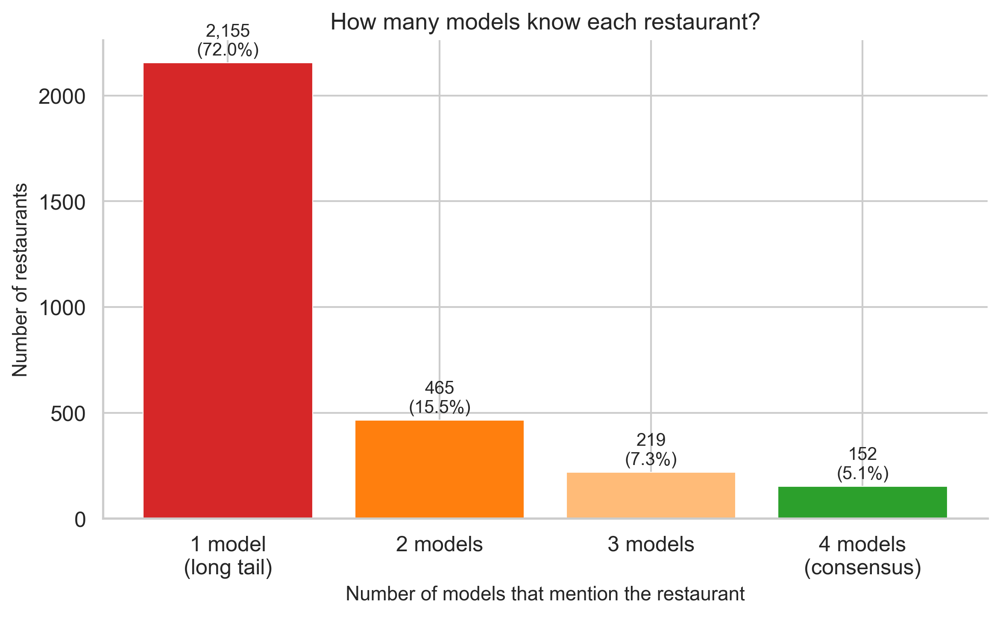
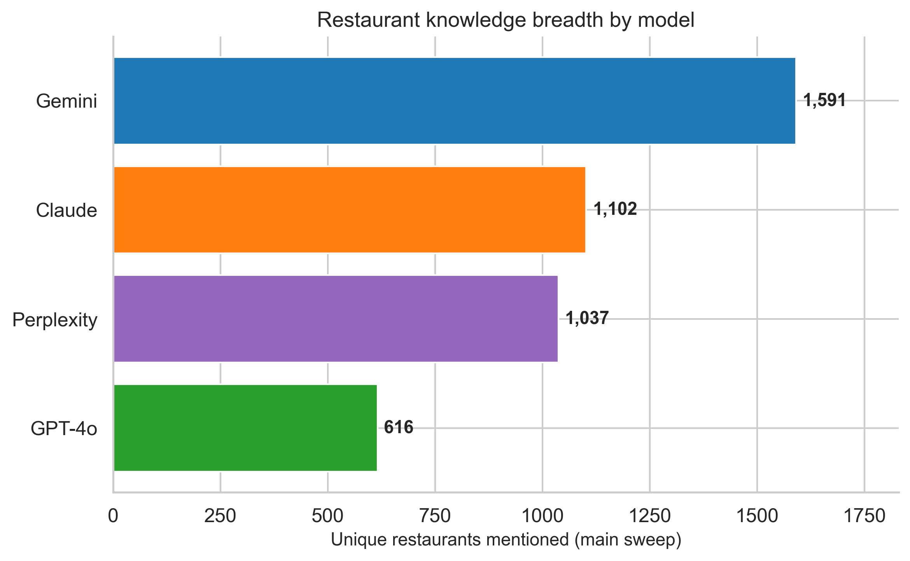
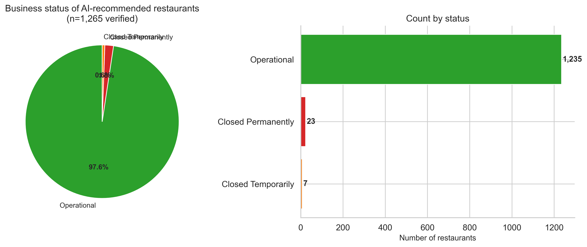
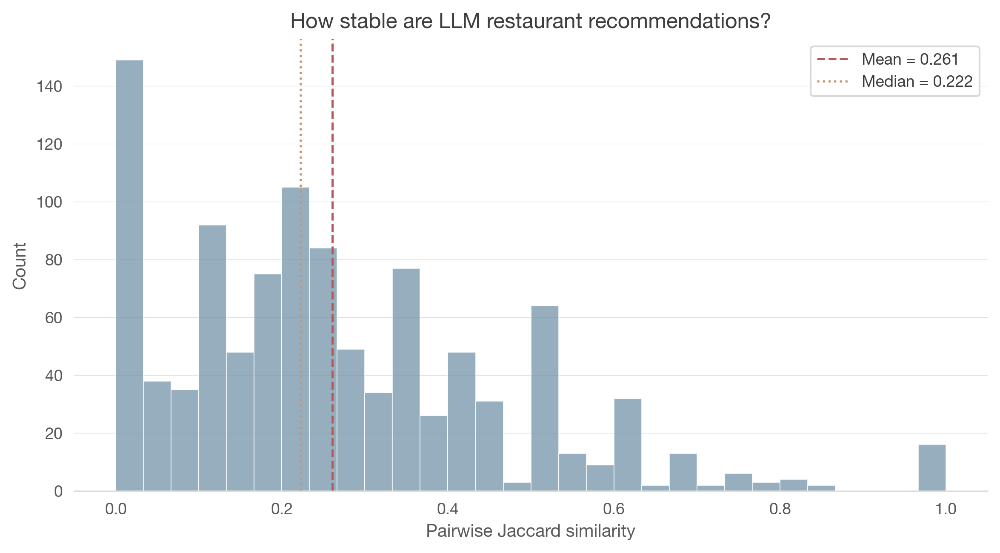
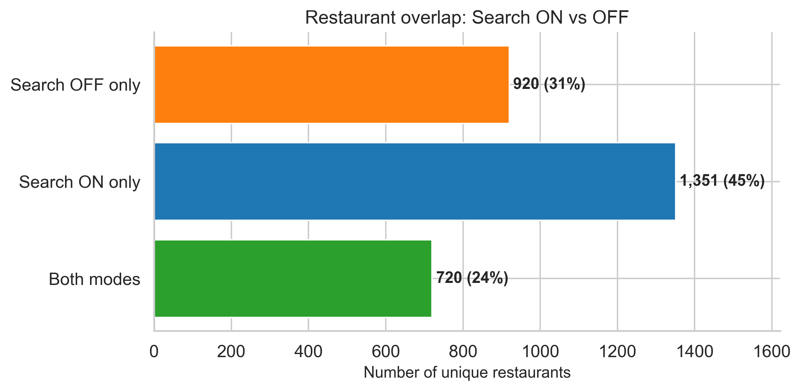
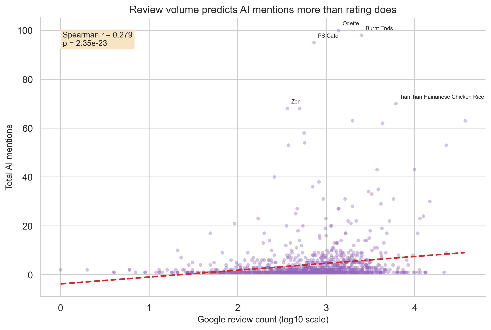

# What Does AI Think About Singapore Restaurants?

**1,690 queries. 4 models. 140 prompts. Ground-truthed against Google Places.**

[](https://www.python.org/downloads/)
[](LICENSE)
[](https://docs.astral.sh/uv/)

---

Ask ChatGPT, Claude, Gemini, or Perplexity where to eat in Singapore. You get a fluent, plausible answer. But how much of it holds up?

This project runs that experiment systematically — 140 restaurant discovery prompts across 4 LLMs, with and without web search, parsed into structured data and verified against Google Places. Open-source research into **Answer Engine Optimization (AEO)** — a field where [companies are raising at $1B+ valuations](https://www.profound.co), but where almost no public, reproducible data exists.

Full analysis in [the notebook](notebooks/01_exploratory.ipynb). Findings below.

## Key Findings

### 1. The AI Canon: Only 5% consensus, 72% known to just one model

Only **152 restaurants (5.1%)** are recommended by all four models. **2,155 (72%)** are mentioned by just one. The shared canon is small — Odette, Burnt Ends, Candlenut, Lau Pa Sat, Hawker Chan — and looks a lot like the English-language food media canon. Everything else is model-specific.



### 2. Model Personalities: Gemini surfaces 2.6x more restaurants than GPT-4o

Gemini mentions **1,591 unique restaurants** across the main sweep. GPT-4o: **616**. Claude and Perplexity fall in between. This tracks with verbosity — Gemini averages 10.9 restaurants per response vs GPT-4o's 5.6. More output means more surface area for lesser-known places.



### 3. The Zombie Restaurant Problem: AI recommends closed restaurants

Of ~1,266 restaurants verified against Google Places, **30 are permanently or temporarily closed**. Among the top 100 most-mentioned verified restaurants, **13% are zombies**. Open Farm Community (44 mentions, all 4 models), Corner House (33 mentions, Michelin-starred), Lolla, Esora, Hashida Sushi — closed, still recommended. Training data staleness in practice.



### 4. Recommendation Instability: ~75% of picks differ between identical queries

Same prompt, same model, five runs. Mean pairwise Jaccard similarity: **0.256**. Roughly 3 out of 4 picks change between runs. 79.5% of appearances are stochastic (2 or fewer out of 5 runs); only 12.7% are core. GPT-4o is the most stable (0.317); Gemini the least (0.224). Single-query AEO studies are measuring noise.



### 5. Search Changes Everything: Only 24% overlap between search ON and OFF

Toggle web search and three-quarters of the restaurant set changes. Only **720 restaurants (24%)** appear in both modes. Search ON surfaces **1,351 restaurants** absent from parametric memory — newer openings, recent press. Search OFF gives you the model's frozen knowledge; Search ON gives you something closer to current reality.



### 6. Fame Beats Quality: Review volume predicts AI mentions, rating doesn't

Google rating has essentially **no correlation** with AI mention frequency (Spearman r = -0.070). Review *count* does (r = 0.279, p < 10^-23). It's not how good the reviews are — it's how many exist. Review volume proxies for online presence and media coverage, which is what ends up in training data.



## Dataset at a Glance

| Metric | Value |
|--------|-------|
| Total queries | 1,690 (1,120 main sweep + 570 stability test) |
| Models | GPT-4o, Claude Sonnet, Gemini 2.5 Flash, Perplexity Sonar |
| Prompts | 140 across 8 dimensions |
| Total restaurant mentions | 12,256 (100% linked to canonical entities) |
| Canonical restaurants (active) | 2,991 |
| Google Places verified | 1,266 |
| Entity resolution merges | 339 (automated + human + place_id) |

## Methodology

### 1. Prompt Library
**140 discovery prompts** spanning 8 dimensions, consolidated from 5 LLM brainstorming sessions (Claude, ChatGPT, Gemini, Grok, Perplexity):

| Dimension | Count | Examples |
|-----------|-------|----------|
| **Cuisine** | 25 | "Best ramen in Singapore", "Where to find authentic Peranakan food" |
| **Occasion** | 20 | "Romantic dinner spot", "Best for a business lunch" |
| **Neighbourhood** | 21 | "Good restaurants near Tiong Bahru", "Best eats in Kampong Glam" |
| **Vibe** | 22 | "Cozy cafe with good coffee", "Lively bar with great food" |
| **Price** | 13 | "Cheap and good dinner", "Worth-the-splurge fine dining" |
| **Constraint** | 13 | "Best vegetarian restaurants", "Late night food after midnight" |
| **Comparison** | 13 | "Burnt Ends vs Nouri — which is better?", "Most overrated restaurant?" |
| **Experiential** | 13 | "Plan my 3-day food trip", "Where do chefs eat on their day off?" |

Each prompt is tagged with specificity level (broad/medium/narrow) for controlled variation.

### 2. Multi-Model Querying
Every prompt is sent to **4 models**, each queried twice (search enabled and disabled):

- **OpenAI GPT-4o** — Responses API with `web_search_preview`
- **Anthropic Claude Sonnet** — `web_search_20250305` server tool
- **Google Gemini 2.5 Flash** — `google_search` grounding
- **Perplexity Sonar** — always search-augmented (with `search_recency_filter`)

### 3. Structured Extraction
Raw responses are parsed into structured data using Claude Haiku 4.5 as an extraction model. For each restaurant mentioned, we capture name, rank position, neighbourhood, cuisine tags, vibe tags, price indicator, and sentiment.

### 4. Entity Resolution
3,332 raw name strings are collapsed into **2,991 canonical restaurants** through three automated stages (exact normalized, base name grouping, fuzzy matching with shared-word penalty) plus human triage and Google place_id deduplication — **339 total merges**.

### 5. Ground Truth
Canonical restaurants are matched against the **Google Places API** (Text Search) and verified by human triage. Business status (operational vs closed) serves as the primary ground truth signal, with rating and review count as secondary signals.

## Quick Start

### Prerequisites
- Python 3.11+
- [uv](https://docs.astral.sh/uv/) (recommended) or pip
- API keys for at least one of: OpenAI, Anthropic, Google, Perplexity

### Setup

```bash
# Clone the repo
git clone https://github.com/spiffler33/sg-restaurant-aeo.git
cd sg-restaurant-aeo

# Install dependencies with uv
uv sync

# Or with pip
pip install -e .

# Configure API keys
cp .env.example .env
# Edit .env with your API keys
```

### Run a Query Sweep

```bash
# Test run: 5 prompts x 4 models
python scripts/test_run.py

# Full sweep: 140 prompts x 4 models x search OFF
python scripts/full_sweep.py

# Full sweep: 140 prompts x 4 models x search ON
python scripts/search_on_sweep.py

# Parse all responses into structured data
python scripts/parse_responses.py

# Entity resolution
python scripts/resolve_entities.py
```

## Project Structure

```
sg-restaurant-aeo/
├── CLAUDE.md              # Development instructions
├── PLAN.md                # Phased development plan
├── OBSERVATIONS.md        # Running log of research findings
├── README.md              # You are here
├── pyproject.toml         # Project config (uv)
├── assets/
│   └── charts/            # High-res chart PNGs for README
├── prompts/
│   ├── discovery_prompts.json    # The master prompt library (140 prompts)
│   ├── extraction_prompt.txt     # System prompt for structured extraction
│   └── raw/                      # Original prompts from 5 LLM brainstorms
├── scripts/
│   ├── full_sweep.py             # Main query sweep (search OFF)
│   ├── search_on_sweep.py        # Search ON sweep
│   ├── parse_responses.py        # Structured extraction pipeline
│   ├── resolve_entities.py       # Entity resolution
│   ├── fetch_google_places.py    # Google Places matching
│   ├── stability_test.py         # Recommendation stability test
│   └── export_charts.py          # Generate README chart images
├── src/
│   ├── models.py           # Pydantic models / DB schema
│   ├── db.py               # SQLite operations (6 tables)
│   ├── query_runner.py     # Multi-model async query execution
│   ├── response_parser.py  # Structured extraction from raw responses
│   ├── entity_resolution.py # Three-stage entity resolution
│   ├── google_places.py    # Google Places API integration
│   ├── stability_metrics.py # Jaccard, Kendall's tau, core/stochastic
│   └── analysis.py         # Core analysis functions
├── notebooks/
│   └── 01_exploratory.ipynb # Flagship analysis (16 figures, 8 takeaways)
├── dashboard/
│   └── app.py              # Streamlit interactive dashboard
├── data/
│   ├── aeo.db             # SQLite database (all structured data)
│   ├── raw/               # Raw API responses (JSON)
│   └── processed/         # Exported CSVs and analysis artifacts
└── tests/
```

## Run It for Your City

This project is designed to be forked. To study LLM restaurant recommendations for **your** city:

1. **Fork this repo**
2. **Adapt the prompt library** — Replace "Singapore" with your city in `prompts/discovery_prompts.json`. Update neighbourhood names, local cuisine references, and cultural context.
3. **Run the query sweep** — The query runner works for any city. Just update the prompts.
4. **Build your ground truth** — Swap in local Google Maps data.
5. **Analyze and share** — The analysis notebooks are city-agnostic. Run them on your data and publish your findings.

Interesting cities to replicate: **Tokyo, Bangkok, London, NYC, Mexico City, Istanbul, Melbourne.**

If you fork this for your city, open a PR to add your repo to a "sister studies" section.

## Contributing

- **Add prompts** — restaurant discovery questions we missed
- **Improve parsing** — edge cases in the extraction pipeline
- **Analyze the data** — find patterns, submit a notebook
- **Ground truth** — Singapore local? help validate AI recommendations
- **Fork for your city** — the most useful contribution

See [PLAN.md](PLAN.md) for the roadmap.

## Research Context

**Answer Engine Optimization (AEO)** is the practice of optimizing content to be surfaced by AI-powered answer engines. Companies like [Profound](https://www.profound.co) have raised hundreds of millions doing this for brands. Almost no public, reproducible research exists.

This project takes the research angle: instead of optimizing *for* AI engines, studying *how* they work. Restaurants are a good domain because:
- Recommendations are subjective — no single right answer
- Ground truth exists (Google Maps, Michelin, local knowledge)
- The stakes are real — restaurants live and die by discovery
- It's universally relatable

## Related Work

- **[DefaultTaste](https://github.com/ilhamfp/DefaultTaste)** — Winner at the Gemini 3 Singapore hackathon (March 7, 2026). Explores AI and default taste formation in food recommendations.

## License

MIT — use this however you want. If you publish research based on this work, a citation would be appreciated.

---

*An open-source research project. MIT licensed.*
